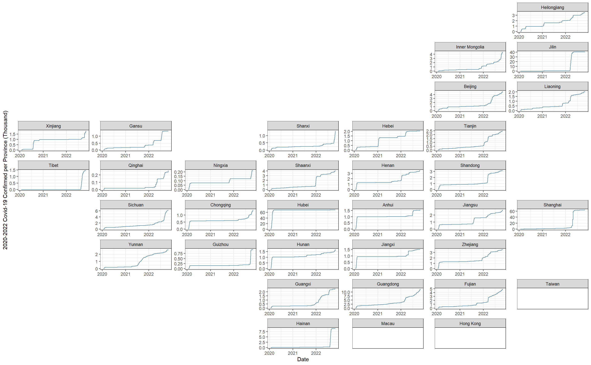

# Results

```{r, setup, include=FALSE}
knitr::opts_chunk$set(collapse = TRUE)
```
```{r}
library(ggplot2)
library(GGally)
library(redav)
library(tidyr)
library(geofacet)
library(tidyverse)
library("readxl")
#install.packages("remotes")
#remotes::install_github("jtr13/redav")
```

## Global Economy Impact
```{r, results='hide'}
df1 <- read_excel("GDP_Global.xlsx")
df1 
```

```{r, results='hide'}
df1_1 <- df1[-c(3)]
df1_1$'2019' <- 100* (df1$'2019'-df1$'2018')/df1$'2018'
df1_1$'2020' <- 100* (df1$'2020'-df1$'2019')/df1$'2019'
df1_1$'2021' <- 100* (df1$'2021'-df1$'2020')/df1$'2020'

df1_1
```

```{r}
ggparcoord(df1_1, columns=3:5, groupColumn=1, scale="globalminmax", title="GDP Growth Rates by Country") +
  xlab("Year")+
  ylab("GDP Growth Precentage")+
  theme_bw()+
  scale_color_discrete(breaks=c("United States", "China", "Japan", "United Kingdom", "Germany"))
```

The graph shows the GDP growth rates for the top five countries with the highest GDP. The GDP of these countries accounts for more than half of the world GDP. They well indicate the global economy. We can observe from the graph that most of the countries, expect China, experienced negative GDP growth in 2020. Most of the countries, expect China and Germany, experienced the lowest GDP growth in 2020. The global economy was not going well during the pandemic. 


```{r, results='hide'}
df2 <- read.csv(file="US Dollar Index Historical Data.csv")
head(df2)
```
There is no missing value for columns used in this project: Date and Price.

```{r, results='hide'}
df2$Date <- as.Date(df2$Date, format = "%m/%d/%Y")
head(df2)
```

```{r}
ggplot(data=df2, aes(Date, Price))+
  geom_line()+
  ggtitle("US Dollar Index")+
  geom_vline(xintercept = as.Date("03/11/2020", format = "%m/%d/%Y"), color="blue", alpha=0.3)+
  annotate("text", x=as.Date("03/11/2020", format = "%m/%d/%Y"), y=112, color="blue", label="The World Health Organization declared \n the COVID-19 outbreak a pandemic \n 2020/03/11", hjust=0)+
  theme_bw()
```

The US dollar index tracks the relative value of the U.S. dollar against a basket of important world currencies: Euro, Japanese yen, Pound sterling, Canadian dollar, Swedish krona, and Swiss franc. The six currencies included in the USDX are often referred to as America's most significant trading partners. So, the index implies the strength of US dollar. US Dollar is considered as the safest asset in the world and investors tend to buy it when the probability of economic recession increases. When more people invest in USD, it is stronger. The US dollar index is a good measure of investor’s panic and global economy. 

We can obverse from the graph that the US dollar index increases dramatically around March 11, 2020, when the World Health Organization declared the COVID-19 outbreak a pandemic. The pandemic lowered investor's confidence in global economy and motivated more investment in safer asset, such as USD. This trend corresponds to what we observed in the previous graph: the global GDP growth dropped significantly during the pandemic. 

Reference: https://www.investopedia.com/terms/u/usdx.asp


## Chinese Economy Impact

### Covid-19 Confirmed Cases Distribution

```{r,fig.height=5, results='hide'}
provinceConfirmed <- read.table('provinceConfirmed.tab',sep='\t',header=TRUE)

T_C = provinceConfirmed[3:1017]
T_C[5,1]= 'Inner Mongolia'
T_C[26,1] = 'Tibet'

T_C = T_C %>% pivot_longer(-ProvEN,names_to = "Date",values_to = "Confirmed")
T_C$'Date' <- ymd(gsub('T_C_','',T_C$'Date'))
```

```{r,fig.height=5,dpi=400, results='hide'}
T_C_Thousand <- T_C
T_C_Thousand$Confirmed <- T_C$Confirmed/1000

ggplot(T_C_Thousand, aes(Date, Confirmed)) +
  geom_line(color = "steelblue") +
  facet_geo(~ ProvEN, grid = "china_prov_grid2",scales = "free") +
  ylab("2020-2022 Covid-19 Confirmed per Province (Thousand)") +
  theme_bw()
```


```{r,fig.height=5, results='hide'}
ggplot(T_C %>% filter(Date < as.Date("2020-03-01")),
          aes(color = ProvEN, Date, `Confirmed`)) + 
          geom_line() + 
          theme_grey(14)
temp = provinceConfirmed[c(1:6,8,10:16,18:31),3:1017]
temp = temp %>% pivot_longer(-ProvEN,names_to = "Date",values_to = "Confirmed")

ggplot(temp,
          aes(Date, `Confirmed`,color = ProvEN)) + 
          geom_line() + 
          theme_grey(14)

```

In this plot, we are visualizing the number of confirmed cases of Covid-19 in various provinces in China from 2020 to 2022. A line plot is used to show the trend of daily confirmed cases over time in each province. The number of confirmed cases (in thousand) is on the y-axis, with the date on the x-axis. The plot is faceted by province, with each province shown in a separate panel using the `facet_geo` function. We can see COVID-19 first outbreak in Hubei province in January 2020, and its surrounding provinces had an increase in the number of confirmed cases in the early stage of the epidemic. However, the increase in the number of confirmed cases in the distant coastal provinces is relatively late. This plot allows us to see the trend of confirmed cases over time in each province and compare the severity of the Covid-19 outbreak across provinces. 

### Economy Impact Analysis

The COVID-19 pandemic will have an impact on different provinces and industries in China. During the outbreak in 2020, transportation, retail, urban registered unemployment rate, total import, total export, net export and other industries all showed a slow growth trend. This pattern of decline is concentrated in the Midwest. As we know, the development of eastern China mainly depends on its technology and services, while the development of central and western China, such as Shanxi, Xinjiang and Inner Mongolia, takes advantage of its abundant resources (coal, metals, cotton). Companies in these areas produce primary products and transfer them to eastern China or abroad for further processing.

To better illustrate the downward trend, we use the percentage change in growth rates between 2020 and 2019 to measure the decline. To ensure that the worse the indicator, the darker the map, we use the negative sign of the original value to draw the graph. 

```{r}
library(readxl)
gdp <- read_excel("china_economics.xlsx", sheet = 1)
transport <- read_excel("china_economics.xlsx", sheet = 2)
retail <- read_excel("china_economics.xlsx", sheet = 3)
unemployment <- read_excel("china_economics.xlsx", sheet = 4)
import <- read_excel("china_economics.xlsx", sheet = 5)
export <- read_excel("china_economics.xlsx", sheet = 6)
delta_gdp <- (gdp$`2020`-gdp$`2019`)/gdp$`2019` - (gdp$`2019`-gdp$`2018`)/gdp$`2018`
delta_transport <- (transport$`2020`-transport$`2019`)/transport$`2019` - (transport$`2019`-transport$`2018`)/transport$`2018`
delta_retail <- (retail$`2020`-retail$`2019`)/retail$`2019` - (retail$`2019`-retail$`2018`)/retail$`2018`
delta_unemployment <- (unemployment$`2020`-unemployment$`2019`)/unemployment$`2019` - (unemployment$`2019`-unemployment$`2018`)/unemployment$`2018`
delta_import <- (import$`2020`-import$`2019`)/import$`2019` - (import$`2019`-import$`2018`)/import$`2018`
delta_export <- (export$`2020`-export$`2019`)/export$`2019` - (export$`2019`-export$`2018`)/export$`2018`
delta_net_export <- ((export$`2020`-import$`2020`)-(export$`2019`-import$`2019`))/(export$`2019`-import$`2019`) - ((export$`2019`-import$`2019`)-(export$`2018`-import$`2018`))/(export$`2018`-import$`2018`)
```

As we can see from the chart below, the GDP growth rate of most provinces in China declined from 2019 to 2020, especially the central provinces. Hubei, the province where the epidemic first broke out, saw the biggest drop. The situation is similar in the neighboring provinces of Hubei.

As can be seen from figures 2 and 3, western and central China suffered the greatest losses in terms of transportation and retail sales. Especially Hubei and Xinjiang. Xinjiang has a famous port called "Horgos", the largest railway port in Xinjiang Uygur Autonomous Region, which mainly supports the development of Xinjiang's textile and clothing industry, as well as foreign trade and service industry. Lockdown policies in western provinces tend to be stricter in the west, which will have a negative impact on traffic and retail revenue in western provinces.

We analyze unemployment in the fourth chart. From 2019 to 2020, the rate of unemployment growth in most provinces was positive. We can only see declines in a few western and central provinces.

In figures 5, 6 and 7, we focus on the transaction records of Chinese provinces. Provinces close to the border have seen a drop in imports and exports. Between 2019 and 2020, the growth rate of net exports in Tibet and Yunnan fell sharply. The impact on the eastern region is slighter than the Midwest. As noted above, the western provinces tended to have more restrictive lockdown policies, and their economies were more dependent on trade in resources and raw materials. We believe this is a contributing factor to the above results.

```{r}
# install.packages('hchinamap', build_vignettes = TRUE)
library(dplyr)
library(magrittr)
library(hchinamap)
dir <- tempdir()
download.file('https://czxb.github.io/br/chinadf.rda', file.path(dir, 'chinadf.rda'))
load(file.path(dir, 'chinadf.rda'), verbose = TRUE);
china <- chinadf %>% dplyr::filter(region == "China")
hchinamap(name = china$name[1:length(delta_gdp)], value = -delta_gdp,
           width = "100%", height = "400px",
           title = "Change of GDP Growth Rate - China", region = "China")
hchinamap(name = china$name[1:length(delta_transport)], value = -delta_transport,
           width = "100%", height = "400px",
           title = "Change of Transport Growth Rate - China", region = "China")
hchinamap(name = china$name[1:length(delta_retail)], value = -delta_retail,
           width = "100%", height = "400px",
           title = "Change of Retail Growth Rate - China", region = "China")
hchinamap(name = china$name[1:length(delta_unemployment)], value = -delta_unemployment,
           width = "100%", height = "400px",
           title = "Change of Unemployment Growth Rate - China", region = "China")
hchinamap(name = china$name[1:length(delta_import)], value = -delta_import,
           width = "100%", height = "400px",
           title = "Change of Import Growth Rate - China", region = "China")
hchinamap(name = china$name[1:length(delta_export)], value = -delta_export,
           width = "100%", height = "400px",
           title = "Change of Export Growth Rate - China", region = "China")
hchinamap(name = china$name[1:length(delta_net_export)], value = -delta_net_export,
           width = "100%", height = "400px",
           title = "Change of Net Export Growth Rate - China", region = "China")
```
